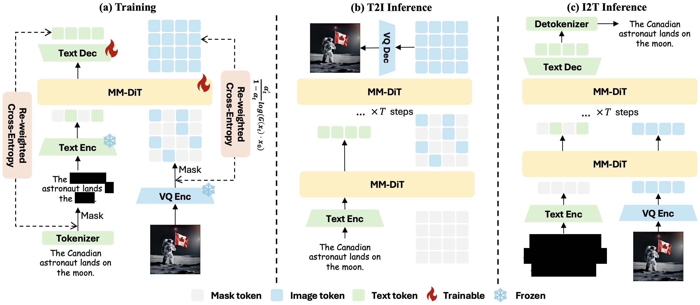
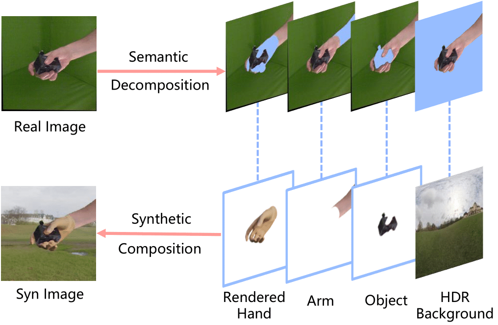
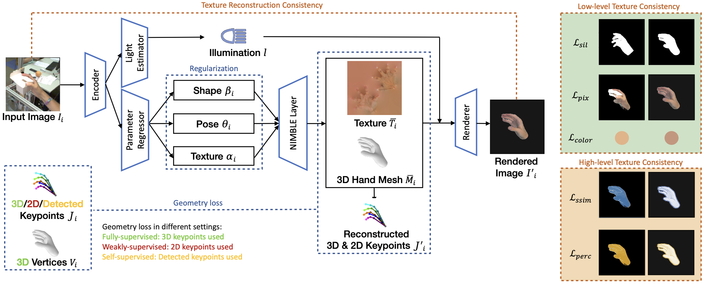

I'm Zhuoran Zhao, a second-year PhD student in Computational Media and Arts at HKUST(GZ), supervised by [Prof. Pan Hui](https://panhui.people.ust.hk/) and [Prof. Anyi Rao](https://anyirao.com/). My research interests are mainly in 3D Computer Vision and Video Generation / Editing. Before that, I received my master's degree in Computer Science (AI Specialization) at National University of Singapore (NUS), supervised by [Prof. Angela Yao](https://www.comp.nus.edu.sg/~ayao/) and [Dr. Linlin Yang](https://mu4yang.com/) at the [CVML Lab](https://cvml.comp.nus.edu.sg/).

I received my B.Eng degree in Software Engineering from South China University of Technology (SCUT). Previously, I had work experience in Tencent and worked as research assistant in SCUT advised by [Prof.Junying Chen](https://scholar.google.com/citations?user=vbIfLPsAAAAJ&hl=zh-CN).

## Recent News
- Feb 2026: Two papers are accepted to ICLR 2026. See you in Rio de Janeiro!
- June 2025: I will attend the [Experimental Model Auditing via Controllable Synthesis workshop](https://sites.google.com/view/emacs2025) and [Rhobin workshop](https://rhobin-challenge.github.io/index.html) at CVPR as "invited poster"!
- Feb 2025: One paper is accepted to CVPR 2025. See you in Nashville!
- Sep 2024: One paper is accepted to SIGGRAPH Asia 2024 Educator's Forum. See you in Tokyo!
- Jul 2024: One paper is accepted to SIGGRAPH Asia 2024.
- Jul 2023: One paper is accepted to GCPR 2023.
- June 2023: One paper is accepted to AAAI 2023 Summer Symposium - AI x Metaverse, with **Best Paper Award**.

## Selected Papers

  <!-- <video controls autoplay width="30%" style="margin-right: 30px;">
    <source src="../images/infnerf.mp4" type="video/mp4">
  </video> -->
  
    

        
<strong>SesaHand: Enhancing 3D Hand Reconstruction via Controllable Generation with Semantic and Structural Alignment</strong>

        
<strong>Zhuoran Zhao</strong>, Xianghao Kong, Linlin Yang, Zheng Wei, Pan Hui, Anyi Rao

        
ICLR 2026.

        
[<a href="https://openreview.net/forum?id=sKMgGQQy7g&referrer=%5BAuthor%20Console%5D(%2Fgroup%3Fid%3DICLR.cc%2F2026%2FConference%2FAuthors%23your-submissions)">Openreview</a>]

    

  <!-- <video controls autoplay width="30%" style="margin-right: 30px;">
    <source src="../images/infnerf.mp4" type="video/mp4">
  </video> -->
  
    

        
<strong>Muddit: Liberating Generation Beyond Text-to-Image with a Unified Discrete Diffusion Model</strong>

        
Qingyu Shi, Jinbin Bai, <strong>Zhuoran Zhao</strong>, Wenhao Chai, Kaidong Yu, Jianzong Wu, Shuangyong Song, Yunhai Tong, Xiangtai Li, Xuelong Li, Shuicheng Yan

        
ICLR 2026.

        
[<a href="https://arxiv.org/pdf/2505.23606">Paper</a>] [<a href="https://github.com/M-E-AGI-Lab/Muddit">Code</a>]

    

  <!-- <video controls autoplay width="30%" style="margin-right: 30px;">
    <source src="../images/infnerf.mp4" type="video/mp4">
  </video> -->
  
    

        
<strong>Composing Concepts from Images and Videos via Concept-prompt Binding</strong>

        
Xianghao Kong, Zeyu Zhang, Yuwei Guo, <strong>Zhuoran Zhao</strong>, Songchun Zhang, Anyi Rao

        
arXiv Preprint, 2025.

        
[<a href="https://arxiv.org/abs/2512.09824">Paper</a>] [<a href="https://refkxh.github.io/BiCo_Webpage/">Project Page</a>] [<a href="https://github.com/refkxh/bico">Code</a>]

    

  <!-- <video controls autoplay width="30%" style="margin-right: 30px;">
    <source src="../images/infnerf.mp4" type="video/mp4">
  </video> -->
  
    

        
<strong>Analyzing the Synthetic-to-Real Domain Gap in 3D Hand Pose Estimation</strong>

        
<strong>Zhuoran Zhao</strong>, Linlin Yang, Pengzhan Sun, Pan Hui, Angela Yao

        
The IEEE/CVF Conference on Computer Vision and Pattern Recognition (CVPR), 2025.

        
[<a href="https://arxiv.org/pdf/2503.19307">Paper</a>] [<a href="https://github.com/delaprada/HandSynthesis">Code</a>]

    

  <!-- <video controls autoplay width="30%" style="margin-right: 30px;">
    <source src="../images/infnerf.mp4" type="video/mp4">
  </video> -->
  
    

        
<strong>Embodied AI-Guided Interactive Digital Teacher for Education</strong>

        
<strong>Zhuoran Zhao</strong>*, Zhizhuo Yin*, Jia Sun, Pan Hui

        
SIGGRAPH Asia, 2024 Educator's Forum.

        
[<a href="https://dl.acm.org/doi/10.1145/3680533.3697070">Paper</a>]

        
Our system was used in the CMAA5025 Social Media for Creativity Spring Course!

    

  <!-- <video controls autoplay width="30%" style="margin-right: 30px;">
    <source src="../images/infnerf.mp4" type="video/mp4">
  </video> -->
  
    

        
<strong>InfNeRF: Towards Infinite Scale NeRF Rendering with O(log n) Space Complexity</strong>

        
Jiabin Liang, Lanqing Zhang, <strong>Zhuoran Zhao</strong>, Xiangyu Xu

        
SIGGRAPH Asia, 2024.

        
[<a href="https://dl.acm.org/doi/pdf/10.1145/3680528.3687646">Paper</a>] [<a href="https://jiabinliang.github.io/InfNeRF.io/">Project Page</a>] [<a href="https://github.com/sail-sg/InfNeRF.git">Code</a>]

    

    
    

        
<strong>HiFiHR: Enhancing 3D Hand Reconstruction from a Single Image via High-Fidelity Texture</strong>

        
Jiayin Zhu, <strong>Zhuoran Zhao</strong>, Linlin Yang, Angela Yao

        
German Conference on Pattern Recognition (GCPR), 2023.

        
[<a href="https://arxiv.org/abs/2308.13628">Paper</a>] [<a href="https://github.com/viridityzhu/HiFiHR">Code</a>]

    

    
    

        
<strong>Taming Diffusion Models for Music-driven Conducting Motion Generation</strong>

        
<strong>Zhuoran Zhao</strong>*, Jinbin Bai*, Delong Chen, Debang Wang, Yubo Pan

        
AAAI Symposia Proceedings, 2023.

        
[<a href="https://arxiv.org/abs/2306.10065">Paper</a>] [<a href="https://github.com/viiika/Diffusion-Conductor">Code</a>]

    

 

## Industrial Experience

    
    

        
<strong>Sea AI Lab</strong>

        
Research Engineer Intern

        
Topic: Large-scale 3D Scene Reconstruction

        
Aug 2023 - Dec 2023

    

 

    
    

        
<strong>Tencent</strong>

        
Frontend Developer

        
July 2021 - July 2022

    

<!-- ## Preprint

    
    

        
<strong>Muddit: Liberating Generation Beyond Text-to-Image with a Unified Discrete Diffusion Model</strong>

        
Qingyu Shi, Jinbin Bai, <strong>Zhuoran Zhao</strong>, Wenhao Chai, Kaidong Yu, Jianzong Wu, Shuangyong Song, Yunhai Tong, Xiangtai Li, Xuelong Li, Shuicheng Yan

        
[<a href="https://arxiv.org/abs/2306.10065">Paper</a>]
    

 -->

<!-- - HiFiHR: Enhancing 3D Hand Reconstruction from a Single Image via High-Fidelity Texture 
  Jiayin Zhu, **Zhuoran Zhao**, Linlin Yang, Angela Yao  
  German Conference on Pattern Recognition (GCPR), 2023.  
  [Paper](https://arxiv.org/abs/2308.13628) / [Code](https://github.com/viridityzhu/HiFiHR) -->

<!-- - Taming Diffusion Models for Music-driven Conducting Motion Generation  
  **Zhuoran Zhao**, Jinbin Bai, Delong Chen, Debang Wang, Yubo Pan  
  AAAI symposia proceedings, 2023.  
  [Paper](https://arxiv.org/abs/2306.10065) / [Code](https://github.com/viiika/Diffusion-Conductor) -->

## Teaching
- CMAA5025 Social Media for Creativity Spring 2024-25, Teaching Assistant
