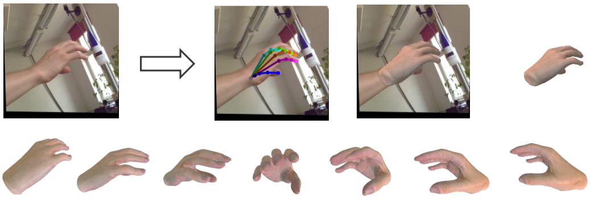
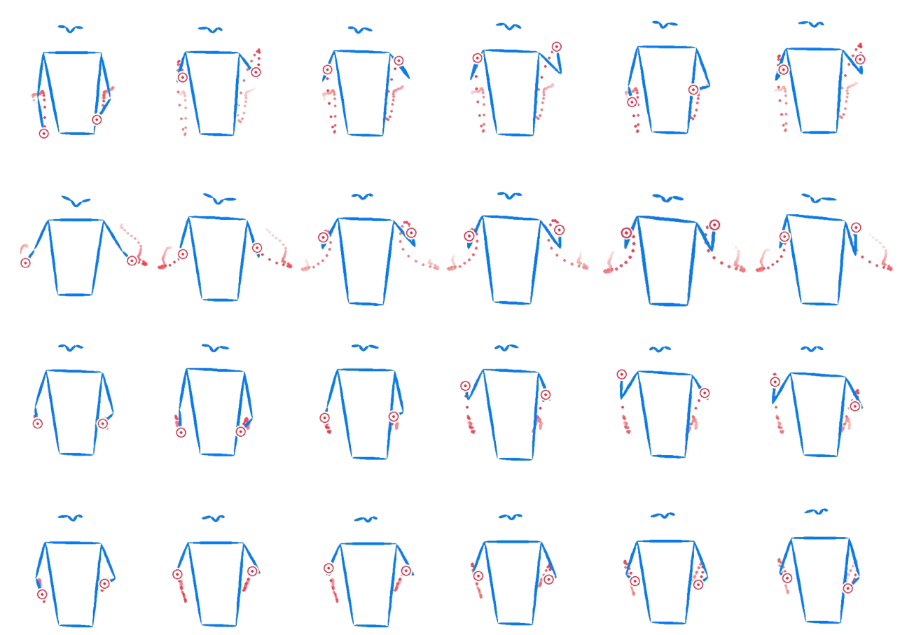

I'm Zhuoran Zhao, a first-year PhD student in CMA at HKUST(GZ), supervised by [Prof. Pan Hui](https://panhui.people.ust.hk/). My research interests are mainly in Computer Vision in 3D and multi-modal generation. Before that, I received my master's degree in Computer Science (AI Specialization) at National University of Singapore (NUS), supervised by [Prof. Angela Yao](https://www.comp.nus.edu.sg/~ayao/) and [Dr. Linlin Yang](https://mu4yang.com/) at the [CVML Lab](https://cvml.comp.nus.edu.sg/).

I received my B.Eng degree in Software Engineering from South China University of Technology (SCUT). Previously, I had work experience in Tencent and worked as research assistant in SCUT advised by [Prof.Junying Chen](https://scholar.google.com/citations?user=vbIfLPsAAAAJ&hl=zh-CN).

## Recent News
- Sep 2024: One paper is accepted to SIGGRAPH Asia 2024 Educator's Forum.
- Jul 2024: One paper is accepted to SIGGRAPH Asia 2024.
- Jul 2023: One paper is accepted to GCPR 2023.
- June 2023: One paper is accepted to AAAI 2023 Summer Symposium - AI x Metaverse, with **Best Paper Award**.

## Recent Publications

  <!-- <video controls autoplay width="30%" style="margin-right: 30px;">
    <source src="../images/infnerf.mp4" type="video/mp4">
  </video> -->
  
    

        
<strong>InfNeRF: Towards Infinite Scale NeRF Rendering with O(log n) Space Complexity</strong>

        
Jiabin Liang, Lanqing Zhang, <strong>Zhuoran Zhao</strong>, Xiangyu Xu

        
SIGGRAPH Asia, 2024.

        
<a href="https://arxiv.org/abs/2403.14376v2">Paper</a> / <a href="https://jiabinliang.github.io/InfNeRF.io/">Project Page</a>

    

    
    

        
<strong>HiFiHR: Enhancing 3D Hand Reconstruction from a Single Image via High-Fidelity Texture</strong>

        
Jiayin Zhu, <strong>Zhuoran Zhao</strong>, Linlin Yang, Angela Yao

        
German Conference on Pattern Recognition (GCPR), 2023.

        
<a href="https://arxiv.org/abs/2308.13628">Paper</a> / <a href="https://github.com/viridityzhu/HiFiHR">Code</a>

    

    
    

        
<strong>Taming Diffusion Models for Music-driven Conducting Motion Generation</strong>

        
<strong>Zhuoran Zhao</strong>, Jinbin Bai, Delong Chen, Debang Wang, Yubo Pan

        
AAAI Symposia Proceedings, 2023.

        
<a href="https://arxiv.org/abs/2306.10065">Paper</a> / <a href="https://github.com/viiika/Diffusion-Conductor">Code</a>

    

<!-- - HiFiHR: Enhancing 3D Hand Reconstruction from a Single Image via High-Fidelity Texture 
  Jiayin Zhu, **Zhuoran Zhao**, Linlin Yang, Angela Yao  
  German Conference on Pattern Recognition (GCPR), 2023.  
  [Paper](https://arxiv.org/abs/2308.13628) / [Code](https://github.com/viridityzhu/HiFiHR) -->

<!-- - Taming Diffusion Models for Music-driven Conducting Motion Generation  
  **Zhuoran Zhao**, Jinbin Bai, Delong Chen, Debang Wang, Yubo Pan  
  AAAI symposia proceedings, 2023.  
  [Paper](https://arxiv.org/abs/2306.10065) / [Code](https://github.com/viiika/Diffusion-Conductor) -->
